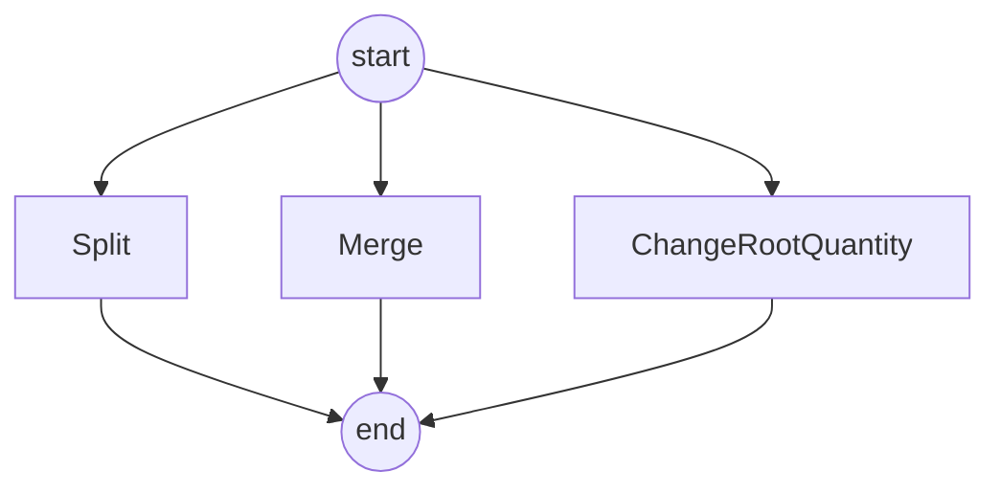

# working solution

> Design and implement "Shipment Management" program with unit tests.


Development environment

- win10
- jdk8
- spring boot 2
- eclipse


# Requirement Analysis

Our firm has trading arrangement with a supplier to ship goods to us. As part of trade agreement, the supplier agrees to ship x metric tons of goods in N number of shipments. N can be one or more. The supplier can alter the shipments allowing her to split or merge shipments.

- Split

> Split operation on a shipment, would create more than on shipments with specified quantities, sum of all child shipment quantities should be equal to parent shipment 
>
> quantity.

- Merge

> merge operation on more than one shipment, would create one child shipment with summed up quantity. Sum of all parent shipment quantities should be equal to child shipment quantity.

- Change root quantity

> This operation applies to trade. When trade quantity is changed, all shipment quantities should be updated proportionally.

A trade would always start with on shipment initially. This shipment quantity would be same as trade quantity. The shipments would grow in number based on splits/merges.


## Main



# API List

[api list](http://localhost:8080/swagger-ui.html)

## split

```shell
curl -X POST --header 'Content-Type: application/json' --header 'Accept: */*' 'http://localhost:8080/split'
```

## merge

```shell
curl -X POST --header 'Content-Type: application/json' --header 'Accept: */*' 'http://localhost:8080/merge'
```


## increase

```shell
curl -X PUT --header 'Content-Type: application/json' --header 'Accept: application/json' -d '200' 'http://localhost:8080/increase'
```


## decrease

```shell
curl -X PUT --header 'Content-Type: application/json' --header 'Accept: application/json' -d '50' 'http://localhost:8080/decrease'
```

